#  Task List Website 
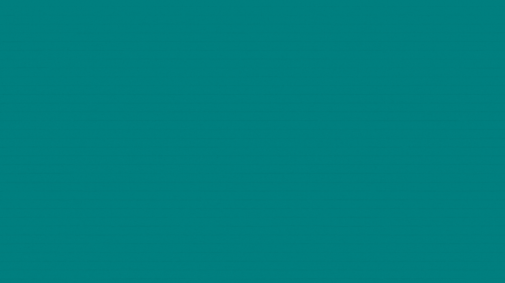

 Made by Klaudia Kępka

##  Task List Demo Website:
[Task List Demo Website](https://kepkaklaudia.github.io/taskList/)

##  Quick Preview

## Add new task field
On the page you can find the input field to add your task

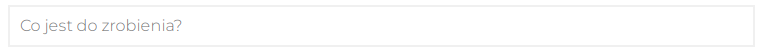

## Add new task button
On the right side of the input field you can find a button in teal color 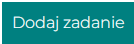 which is used to add tasks to the list.

After clicking it, the cursor will automatically focus on the input field to enter a new task.

## List of Tasks
After added new task it will be written below in the List of Tasks.

On the left side of the task you will see a green square 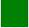 - it is a marker that allows you to mark whether the task has been completed. When you click it, a check mark will appear in the square and the text will be crossed out 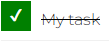. When you click it again, both the strikethrough and the check mark will disappear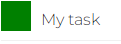.

On the right of the task, you'll see a red square with a trash can icon 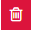. After clicking it, the corresponding task will be deleted.

## Responsive version
When you are in mobile/tablet mode (maximum width of screen: 550px) you can notice some changes.

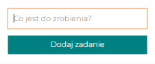

The input field outline illumination changes from black to orange. In addition, both the input field and the button take up the entire available width.

## Technologies used

 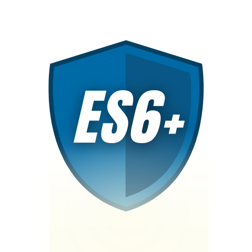

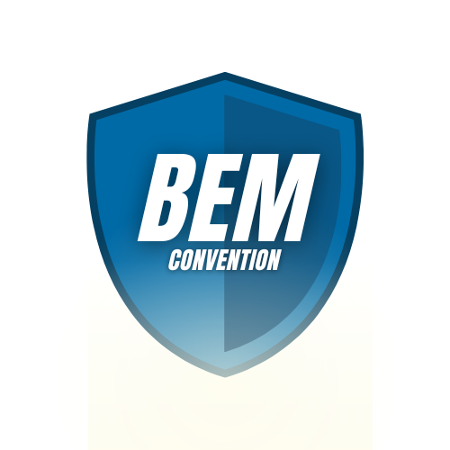

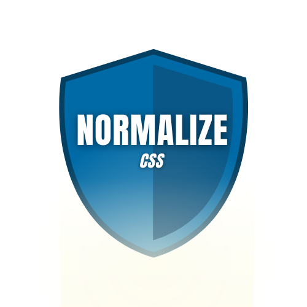