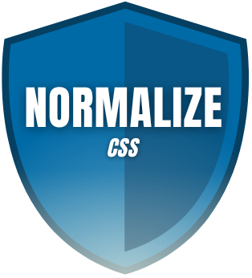

#  Task List Website 

 Made by Klaudia Kępka

##  Task List Demo Website:
[Task List Demo Website](https://kepkaklaudia.github.io/task-list/)

##  Quick Preview

## Add new task field
On the page you can find the input field to add your task

## Add new task button
On the right side of the input field you can find a button in teal color which is used to add tasks to the list.

After clicking it, the cursor will automatically focus on the input field to enter a new task.

## List of Tasks
After added new task it will be written below in the List of Tasks.

On the left side of the task you will see a green square - it is a marker that allows you to mark whether the task has been completed ✅. When you click it, a check mark will appear in the square and the text will be crossed out. When you click it again, both the strikethrough and the check mark will disappear.

On the right of the task, you'll see a red square with a trash can icon 🗑. After clicking it, the corresponding task will be deleted.

After adding a task, two buttons "Ukryj ukończone" and "Ukończ wszystkie" will appear on the right side of the section. 

When you have any completed tasks in your list, you can hide them with the first button. The button will change its name to "Pokaż ukończone" - when you click it again, all your completed tasks will be shown again. 

You can use the second button to complete all your quests. When all tasks are completed, this button is inactive.

## Responsive version
When you are in mobile/tablet mode (maximum width of screen: 550px) you can notice some changes.

The input field outline illumination changes from black to orange. In addition, both the input field and the button take up the entire available width.

## Technologies used
     